# Setting up a database using Supabase


## Introduction

The objective of this and the following tutorials is to  build a web application consisting of a Database, Web API and a Web  Client.

The API will act as a web interface for the Database, allowing data access via HTTP.

The Client will act as the user interface to read, create, update, and delete data objects.

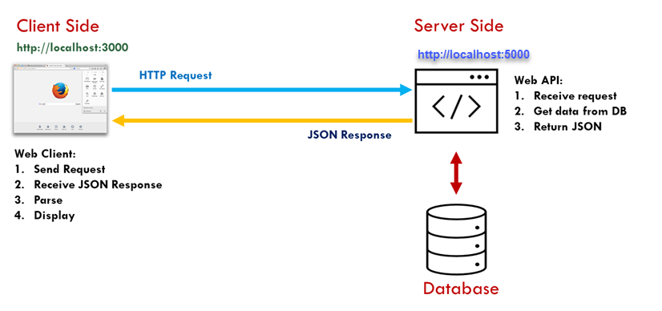

We will be using a Relational SQL database provided by http://supabase.io. This is a cloud-based service which provides a free database with a built in web and JavaScript API for accessing the database via HTTP. This has the advantage of not requiring a separate API layer to access data. 

## Setting up a Supabase account

Supabase is free to use for small projects and you can sign up using your GitHub account. 
It is also very well documented.

To set up your account, visit <https://supabase.io/> and sign in using your GitHub account. If you don’t have one, set up a GitHub account using your student email account.

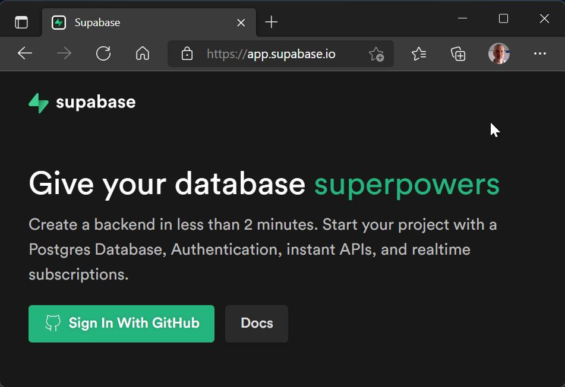

## The database ERD

To get started and test Supabase, this example will demonstrate how to setup an application to log events in a computer network. The database will use two tables: **categories** and **products**, where a computer can have **1 to Many** events. Later we will send events for a particular computer via an MQTT script and store them in the DB.


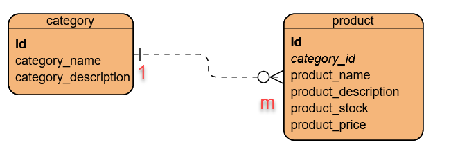

## 1. Create a new database

### 1.1. A new Supabase Project for the database

After logging in choose **New Project** from the dashboard.


### 1.2. Add the new project to your ‘organisation’

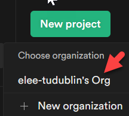

### 1.3. Fill in the details

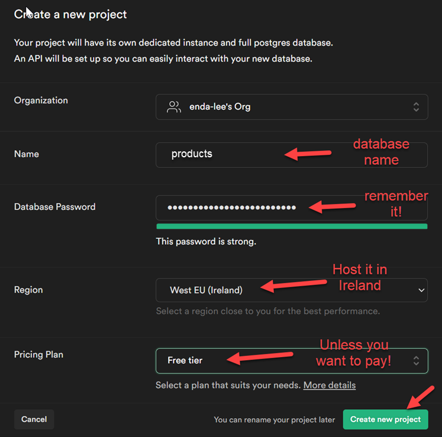

### 1.4. Wait for setup to complete

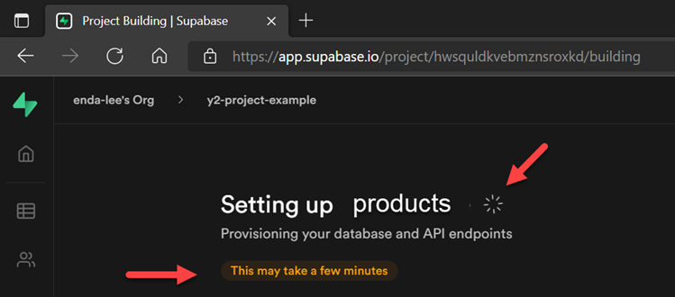

## 2. Add tables to the database

Once setup has completed, the welcome page will display.

### 2.1. Choose the ‘table editor’

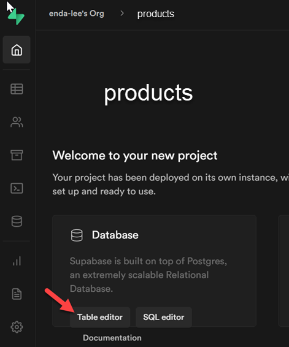

### 2.2. Add the category table

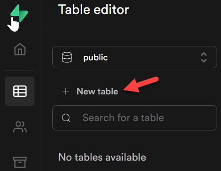

#### 1. Add the columns and set the data types as shown below. Set the id column as Primary Key

 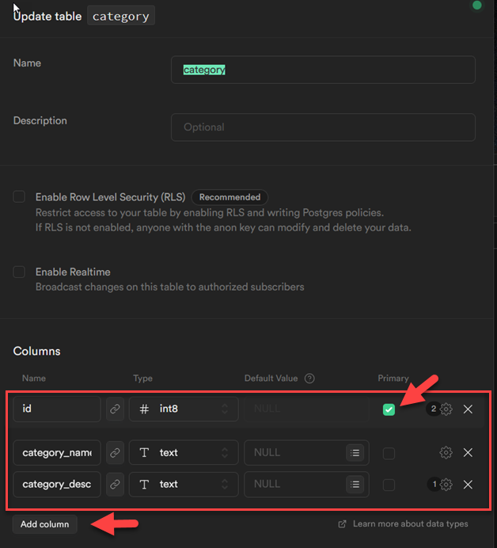


#### 2. Set column attributes

Id should be set as an identity column so that it auto increments as rows are
added


Null values should *not be allowed* for **category_name** and **category_description**

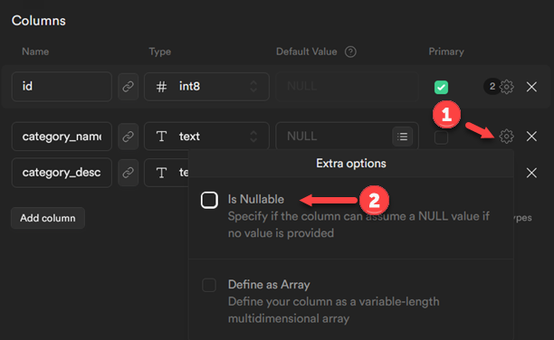

#### 3. Save the table

Don’t for get to do this after editing the table…

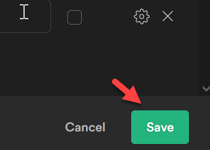

### 2.3.  Add the product table

#### 1. Add a new table named product

Name the columns and set data types as below. Set id as the primary key.

Use the settings icon to set id as an identity and the other columns as not
nullable.

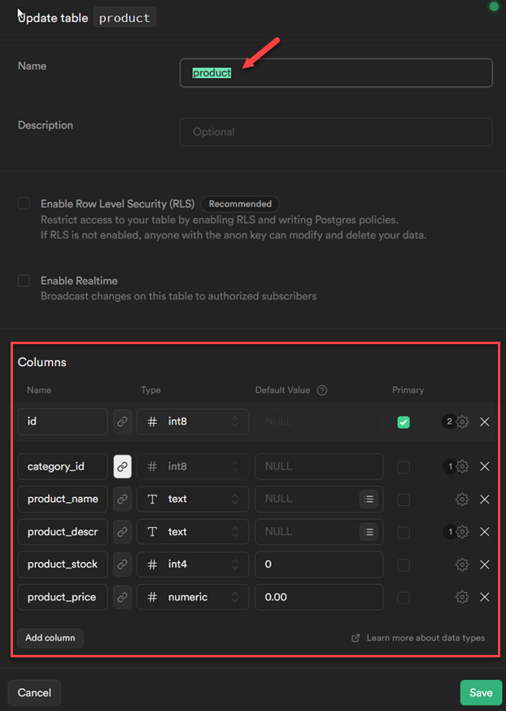

#### 2. Set category_id (in product table) as a foreign key

This column will reference the id column in the computers table.

Click the link icon next to **category_id**, then create the foreign key
relation:

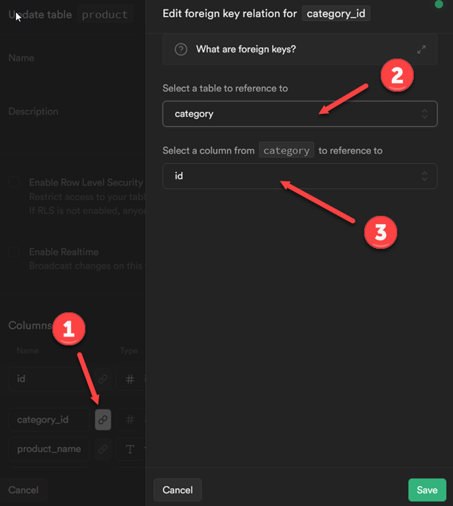

#### 3. Review in the Supabase dashboard

At this point you should have a database with two tables.

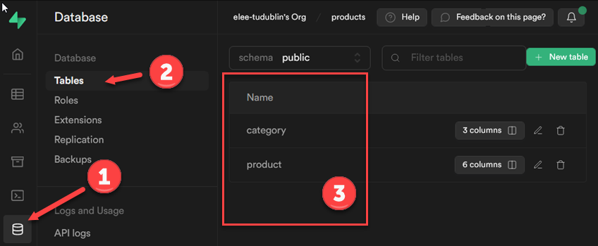

## 3. SQL in Supabase

The database you created runs on PostgreSQL which is like Oracle and other relational databases. Just like the others, PostgreSQL supports SQL for working with database relations.

### 3.1. Open the query editor

In the Supabase console/ dashboard, open the SQL Editor using its icon:

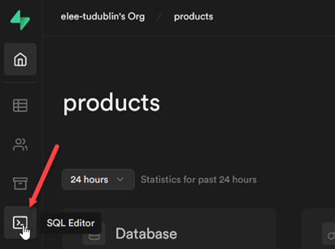

The welcome page provides help and sample SQL for common tasks. To run your own
SQL, choose **+ New query**

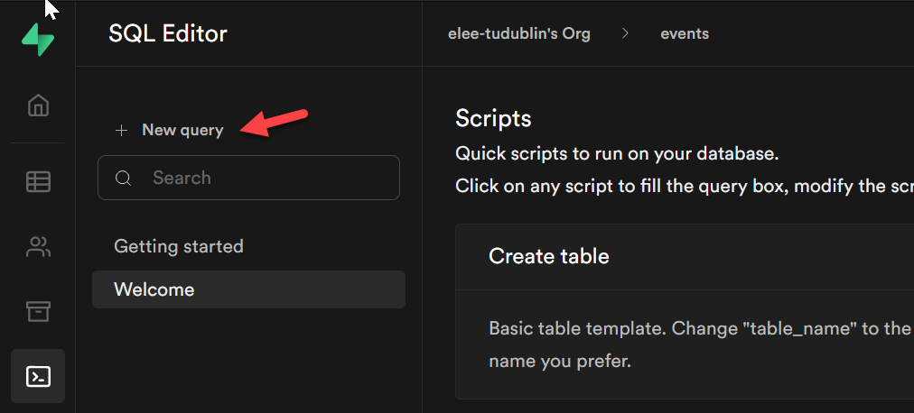

### 3.2. SQL to select all products

After the new query windows opens, enter the SQL to **```sql select * from product```**. Then run the query.


### 3.3. Sample data

You won’t have any results to display until some data is added. 

You can use the following SQL to insert some same data:

``` sql
-- sample data for product database- SQL inserts

-- category table data
INSERT INTO category(id, category_name, category_description) VALUES
(1, 'Books', 'Paper and hard cover, fiction and non-fiction');
INSERT INTO category(id, category_name, category_description) VALUES
(2, 'Computer', 'Desktop, laptops, and accessories');
INSERT INTO category(id, category_name, category_description) VALUES
(3, 'Entertainment', 'Home electronicsa, TV, HiFi, etc.');
INSERT INTO category(id, category_name, category_description) VALUES
(4, 'Kitchen', 'Kitchen + cooking appliances');
INSERT INTO category(id, category_name, category_description) VALUES
(5, 'Laundry', 'Clothes washers, dryers, and accesories');
INSERT INTO category(id, category_name, category_description) VALUES
(6, 'Mobile Devices', 'Mobile phones, tablets, and accessories');
INSERT INTO category(id, category_name, category_description) VALUES
(7, 'Furniture', 'Home and home office furniture');


-- the product table data
INSERT INTO product(id, category_id, product_name, product_description, product_stock, product_price) VALUES
(6, 4, 'Kettle', 'Steel Electric Kettle', 100, 55.00);
INSERT INTO product(id, category_id, product_name, product_description, product_stock, product_price) VALUES
(7, 4, 'Fridge freezer', 'Fridge + freezer large', 45, 799.00);
INSERT INTO product(id, category_id, product_name, product_description, product_stock, product_price) VALUES
(8, 2, 'Microsoft Surface Laptop 8', '16GB ram, 512GB SSD', 5, 1299.00);
INSERT INTO product(id, category_id, product_name, product_description, product_stock, product_price) VALUES
(9, 2, '14inch Laptop', 'HP laptop,16GB RAM,1TB SSD', 45, 1099.00);
INSERT INTO product(id, category_id, product_name, product_description, product_stock, product_price) VALUES
(10, 6, 'Samsung 10inch Tablet', 'Android6GB ram, 128GB storage, 10inch screen', 5, 99.00);
INSERT INTO product(id, category_id, product_name, product_description, product_stock, product_price) VALUES
(11, 3, '60inch TV', 'Sony 4K,OLED,Smart TV', 12, 1899.00);
INSERT INTO product(id, category_id, product_name, product_description, product_stock, product_price) VALUES
(12, 5, 'Clothes Washing Machine', '1600rpm spin,A+++ rated,10KG', 50, 699.00);
INSERT INTO product(id, category_id, product_name, product_description, product_stock, product_price) VALUES
(13, 6, 'iPhone 13', '128GB', 5, 850.00);
INSERT INTO product(id, category_id, product_name, product_description, product_stock, product_price) VALUES
(14, 1, 'Azure Web Apps', 'Paperback, January 2020, Cloud publishing', 50, 19.00);
INSERT INTO product(id, category_id, product_name, product_description, product_stock, product_price) VALUES
(16, 7, 'Bed', 'Super King size,super comfort mattress', 5, 899.00);
INSERT INTO product(id, category_id, product_name, product_description, product_stock, product_price) VALUES
(17, 2, 'Learning JavaScript', 'Become a JavaScript expert in 2 hours!', 10, 12.00);
INSERT INTO product(id, category_id, product_name, product_description, product_stock, product_price) VALUES
(18, 7, 'Desk', 'Small computer desk', 5, 99.00);
INSERT INTO product(id, category_id, product_name, product_description, product_stock, product_price) VALUES
(15, 1, 'SQL and No SQL for beginners', 'Paperback, Oct 2021, Cloud publishing', 10, 399.00);
INSERT INTO product(id, category_id, product_name, product_description, product_stock, product_price) VALUES
(20, 7, 'Table', 'A large table', 40, 800.00);
```

After inserting, try  **`select * from product`** again


## 4. The Supabase API

Use the Supabase API to retrieve data from the database and insert new data. Click on the API section in the dashboard to view the settings and documentation. We will be using **client key** and **`SUPABASE_URL`** in the next lab to connect to the API and get data.

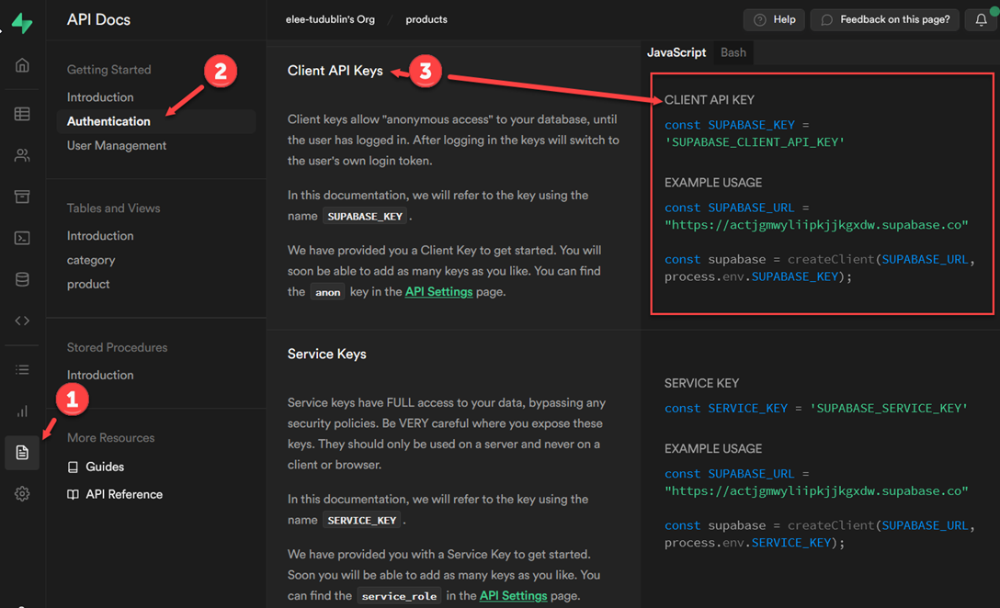


### 4.1.  JavaScript API Documentation

The Supabase dashboard includes documentation and JavaScript code examples showing how to access data and other features. For now, get familiar with the content of this section as we will be refering to it a lot!

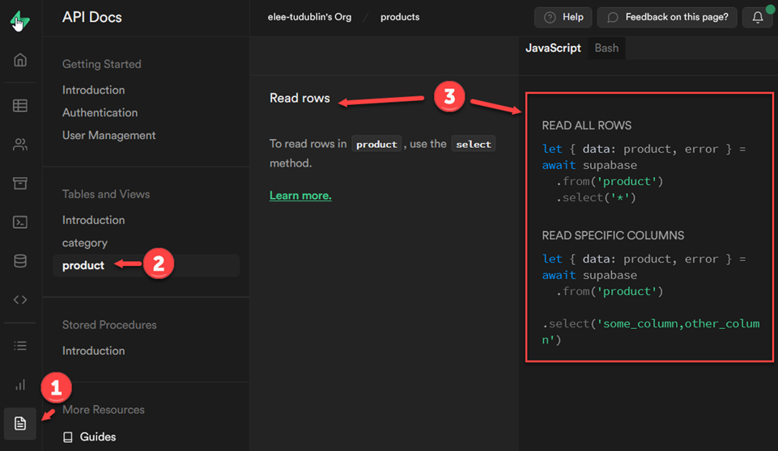

------

**Enda Lee 2022**
